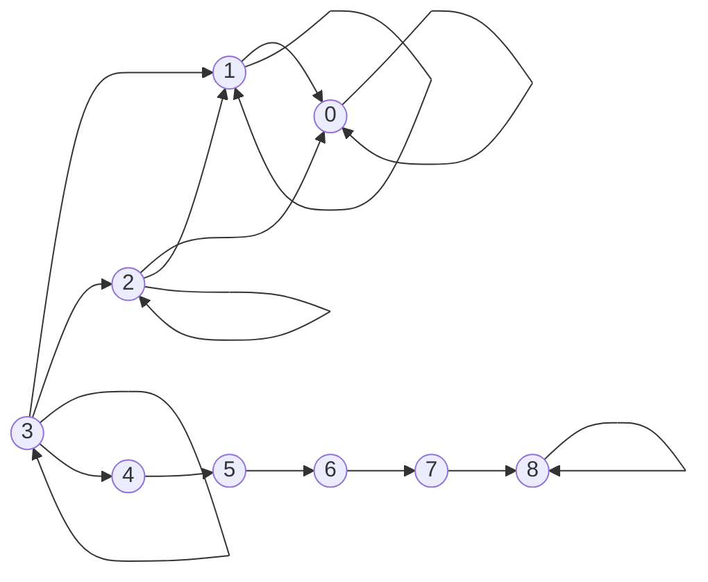

# MDP modeling draft (reactor control under uncertainty)

## State space

Let the reactor power be discretized into 100 states:

\[
S = \{0, 1, 2, \dots, 99\}.
\]

Each state represents a 1% power interval. State 0 corresponds to approximately 0%–1% power and state 99 corresponds to approximately 99%–100% power.

## Action space

There are three actions:

\[
A = \{\text{decrease}, \text{maintain}, \text{increase}\}.
\]

Conceptually, each action represents an operator decision about how to adjust control to move reactor power down, keep it near the current level, or move it up.

## Transition function

The MDP transition model is stochastic:

\[
P(s' \mid s, a).
\]

Transition probabilities are read from the reactor JSON configuration (one reactor model per JSON). The three actions each have three possible outcomes (power changes in discrete steps), with probabilities stored in the JSON in a fixed order:

- decrease outcomes: \(-2, -1, 0\)
- maintain outcomes: \(-1, 0, +1\)
- increase outcomes: \(0, +1, +2\)

These probabilities define the transition tensor \(P\) with shape \(3 \times 100 \times 100\), where

\[
P[a, s, s'] = \Pr(S_{t+1}=s' \mid S_t=s, A_t=a).
\]

## Cost function (conceptual only)

The cost can be expressed as \(C(s, a, s')\). In this project, the demand time-series provides a target power level per timestep; costs are typically based on how far the resulting next state \(s'\) is from the current demand point. A common modeling choice is a distance penalty \(|d_t - s'|\), with an additional multiplicative penalty (e.g., \(\times 2\)) when the chosen action tends to move away from the target direction. This section is conceptual only; implementation is separate.

## Matrix dimensions

- Number of states: \(|S| = 100\)
- Number of actions: \(|A| = 3\)
- Transition matrix: \(P \in \mathbb{R}^{3 \times 100 \times 100}\)
- Cost matrix/tensor: conceptually depends on \((s, a, s')\) and on the demand point \(d_t\)

## Boundary handling

The physical/control abstraction prevents transitions outside the discrete state range.

- If an outcome would produce \(s' < 0\), it is clipped to \(s' = 0\).
- If an outcome would produce \(s' > 99\), it is clipped to \(s' = 99\).

When clipping collapses multiple outcomes into the same boundary state (e.g., at \(s=0\) under decrease, or at \(s=99\) under increase), their probabilities are accumulated into the boundary entry so that each row \(P[a, s, :]\) still sums to 1.

## Simple MDP topology example (states 0..8)

Use states \(\{0,1,\dots,8\}\) as a small illustrative subset:

- decrease: edges to \(s-2, s-1, s\) (clipped at 0)
- maintain: edges to \(s-1, s, s+1\) (clipped at 0 and 8 in this mini-example)
- increase: edges to \(s, s+1, s+2\) (clipped at 8 in this mini-example)

Mermaid sketch (illustrative; labels omit probabilities):

